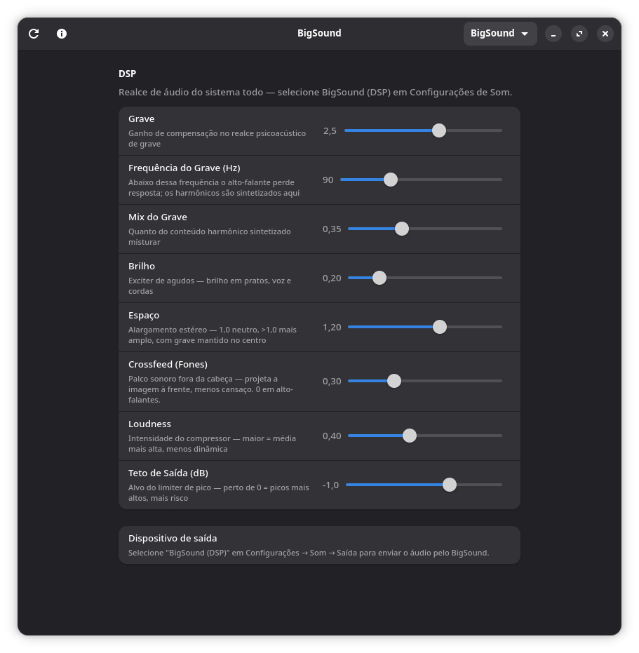

<p align="center">
  
</p>

<h1 align="center">BigSound</h1>

<p align="center">
  System-wide audio enhancement for <b>BigCommunity</b> — a five-stage Rust DSP
  chain routed through PipeWire's filter-chain, with auto-profile per
  output device and a libadwaita frontend for live tuning.
</p>

---

Plays nicely with whatever's already running: Firefox, Spotify, MPV,
Discord, games. Pick "BigSound (DSP)" as your audio output and every app
on the system goes through the chain.

## Screenshot

<p align="center">
  
</p>

The window above shows the libadwaita frontend with the
**BigSound** profile applied (the balanced default), running on
GNOME with locale `pt_BR`. Move any slider and the audio responds within
milliseconds — no service restarts, no config files to edit.

## What it does

| Module        | Role                                                        | Type   |
|---------------|-------------------------------------------------------------|--------|
| **BigBass**   | Psychoacoustic bass enhancement (missing-fundamental synth) | mono ×2 |
| **BigClarity**| Treble exciter — sparkle on hi-hats, vocals, strings        | mono ×2 |
| **BigSpace**  | Stereo widening (Mid/Side) with bass-keep-mono safety       | stereo |
| **BigCross**  | Bauer crossfeed — out-of-head soundstage on headphones      | stereo |
| **BigLoud**   | Stereo-linked compressor + limiter, calibrated make-up gain | stereo |

The chain runs at native sample rate inside PipeWire's realtime audio
path. No FFT, no oversampling, no allocations during process — just
biquads and waveshapers, sample-accurate. Each module is a separate
LADSPA `.so` so PipeWire's `module-filter-chain` can hot-route them
without our daemon being in the audio loop.

### DSP details

- **BigBass** — half-wave-rectified non-linear device (Aarts NLD) on
  the band-passed sidechain, smoothed with `0.5·(x + √(x²+ε))` to
  eliminate the corner-aliasing of a hard rectifier. A peak-envelope
  follower (12 ms attack / 200 ms release) gates the synthesised
  harmonics so the effect only fires when there's bass content,
  preventing buzz on vocals.

- **BigClarity** — high-passed sidechain through `tanh` saturator
  (symmetric → only odd harmonics), then a 16 kHz anti-alias low-pass
  before mixing back. The classical exciter topology used by BBE / Aphex.

- **BigSpace** — Mid/Side decompose, scale Side by `width`, recompose.
  A 200 Hz high-pass on the Side preserves bass mono compatibility:
  laptop speakers that physically sum to mono don't lose low-end energy.

- **BigCross** — Bauer crossfeed: 700 Hz low-passed, 280 µs delayed
  copy of each channel mixed at −9 dB into the opposite ear. Ring-buffer
  delay (zero allocation in the audio loop). The closest free
  equivalent to Atmos / Apple Spatial Audio without HRIR convolution.

- **BigLoud** — feed-forward stereo-linked compressor with soft knee.
  The make-up gain is **calibrated** to the limiter ceiling: for each
  amount value, `make_up = ceiling + max_GR` so a 0 dBFS input lands
  exactly on the ceiling after compression. That's what makes the
  perceived loudness rise instead of dropping — the FxSound trick.

## Auto-profile

Plug headphones, switch to Bluetooth, change to HDMI — BigSound
detects the active output (sink + port via PipeWire) and applies a
matching profile automatically. No clicking, no fiddling.

Built-in profiles:

- **Laptop Speaker** — aggressive bass + heavy compression for tiny
  rolled-off speakers
- **Headphones** — gentle, dynamics preserved, crossfeed on
- **Bluetooth** — bandwidth-aware tuning for BT codec losses
- **HDMI / TV** — neutral, conservative defaults
- **BigSound** (fallback) — balanced hi-fi-friendly default that works
  on any unknown hardware

Plus 10 hand-crafted manual presets: *Studio Reference*, *Atmos / Cinema*,
*Headphones - Cinema*, *Audiophile*, *Punchy*, *Gaming*, *Voice / Podcast*,
*Bass Heavy*, *Late Night*, *Live / Concert*.

## Install

### Arch / Manjaro / BigCommunity (recommended)

```bash
git clone https://github.com/xathay/bigsound.git
cd bigsound/packaging
makepkg -si
systemctl --user enable --now filter-chain.service bigsound-daemon.service
```

Then open *Settings → Sound → Output* and pick **BigSound (DSP)**.

### From source (no root needed)

```bash
git clone https://github.com/xathay/bigsound.git
cd bigsound
./scripts/install.sh
```

The script builds in release mode, installs LADSPA plugins to
`~/.ladspa/`, drops the PipeWire filter-chain config in
`~/.config/pipewire/filter-chain.conf.d/`, and starts the daemon.
Requires `pipewire >= 1.0`, `gtk4`, `libadwaita`, `gettext`, and a Rust
toolchain.

## Use

After installing, **BigSound** appears in the GNOME app launcher.
Open it for live sliders + profile dropdown. From the terminal:

```bash
bigsound show                       # snapshot of current parameters
bigsound profile list               # all profiles
bigsound profile apply Audiophile   # switch profile manually
bigsound set bigloud:amount 0.7     # tune one parameter live
bigsound profile save MyMix         # save current state as a new profile
```

## Architecture

```
apps  ──► BigSound (PipeWire sink)
              │
              └── filter-chain
                    ├── bigbass_l/r       (mono)
                    ├── bigclarity_l/r    (mono)
                    ├── bigspace          (stereo)
                    ├── bigcross          (stereo)
                    └── bigloud           (stereo)
              │
              ▼
       default real output (analog / HDMI / BT / USB)

D-Bus ◄──── bigsound-daemon ────► pw-cli set-param (live tuning)
GUI/CLI                              (no service restart)
```

Each DSP module is a separate Rust crate compiled to a LADSPA `.so`;
the PipeWire `module-filter-chain` strings them together. The Rust
daemon (`com.bigcommunity.BigSound1`) caches parameters in memory,
pushes to PipeWire, and watches for output-device changes to auto-apply
the matching profile.

## Profiles

| Profile              | Auto-applies to                            | Character               |
|----------------------|--------------------------------------------|-------------------------|
| Laptop Speaker       | `alsa_output.pci-*::analog-output-speaker` | Aggressive bass + comp  |
| Headphones           | `*::analog-output-headphones`, headsets    | Gentle, dynamics intact |
| Bluetooth            | `bluez_output.*`                           | Bandwidth-aware         |
| HDMI / TV            | `*.hdmi-*`                                 | Neutral                 |
| BigSound             | (fallback for unknown hardware)            | Balanced hi-fi          |
| Studio Reference     | manual                                     | Transparent / passthrough |
| Atmos / Cinema       | manual                                     | Wide + crossfeed + bass |
| Headphones - Cinema  | manual                                     | Maximalist Bauer crossfeed for stereo cinema content (no HRTF yet) |
| Audiophile           | manual                                     | Minimal coloration      |
| Punchy               | manual                                     | FxSound-style aggressive |
| Gaming               | manual                                     | Wide stereo, transients |
| Voice / Podcast      | manual                                     | Vocal clarity, comp     |
| Bass Heavy           | manual                                     | Maximum sub-bass        |
| Late Night           | manual                                     | Bass cut, heavy comp    |
| Live / Concert       | manual                                     | Venue-feel widening     |

Profiles live in `~/.config/bigsound/profiles/` (user-saved as
`99-user-<name>.json`) and `/usr/share/bigsound/profiles/` (bundled).
The daemon merges both, with user files winning on conflict — your
customisations survive package upgrades.

## Internationalisation

Strings are wrapped with `gettext`. Source language is English (the
`.po` template), Brazilian Portuguese is shipped (`crates/gtk-app/po/pt_BR.po`).
To add another language, copy `pt_BR.po`, translate the `msgstr`
entries, name it `<locale>.po` and reinstall.

## Troubleshooting

**No audio at all after selecting BigSound (DSP)**
&nbsp;&nbsp;Check `systemctl --user status filter-chain.service` — the
service is disabled by default on PipeWire ≥ 1.0. Enable with
`systemctl --user enable --now filter-chain.service`.

**App says "bigsound-daemon doesn't seem to be running"**
&nbsp;&nbsp;`systemctl --user start bigsound-daemon.service`. Check
`journalctl --user -u bigsound-daemon` for errors.

**Sliders don't move the audio**
&nbsp;&nbsp;PipeWire suspends idle sinks and zeros their parameter
struct on resume. The daemon's periodic re-push (every 3 s) fixes
this automatically the moment audio starts flowing — just play
something for ~3 s and the cache will reach the audio path.

**Plugged headphones, profile didn't switch**
&nbsp;&nbsp;Some codecs report headphone insertion as an *active port
change* on the same sink (rather than a sink rename). The daemon
detects both, but only when the new port is `available`. If the
jack-detect on your laptop is unreliable, the active port may revert
to speaker. Workaround: switch in *Settings → Sound → Output*
manually, or save your headphone settings as a manual user profile.

**Want JamesDSP back temporarily**
&nbsp;&nbsp;`systemctl --user stop filter-chain.service bigsound-daemon.service`
disables BigSound without uninstalling. Run JamesDSP normally; reverse
with `systemctl --user start ...` to bring BigSound back.

## Develop

The workspace is a Cargo multi-crate project:

```
BigSound/
├── crates/
│   ├── big-bass/             ← DSP library
│   ├── big-bass-ladspa/      ← LADSPA cdylib wrapper
│   ├── big-clarity/  + -ladspa/
│   ├── big-space/    + -ladspa/
│   ├── big-cross/    + -ladspa/
│   ├── big-loud/     + -ladspa/
│   ├── daemon/               ← bigsound-daemon (D-Bus server)
│   ├── cli/                  ← bigsound (CLI client)
│   └── gtk-app/              ← bigsound-app (libadwaita frontend)
├── configs/pipewire/         ← filter-chain config template
├── packaging/                ← PKGBUILD + bigsound.install
└── scripts/                  ← install.sh, ab-listen.sh
```

Build everything:

```bash
cargo build --release
```

Run a single LADSPA module's offline-WAV test harness (legacy validation
tool for BigBass, before the realtime chain existed):

```bash
cd crates/big-bass
cargo run --release --bin big-bass-cli -- --help
```

A/B helper for offline listening tests:

```bash
./scripts/ab-listen.sh /tmp/bigsound-ab/   # plays each WAV with a banner
```

## License

GPL-3.0-or-later. See [LICENSE](LICENSE).

## Credits

Built by the **BigCommunity Team**. Maintainer:
[Leonardo Athayde](https://github.com/xathay).

DSP techniques credited to: Aarts/Larsen (psychoacoustic bass),
Aphex / BBE (exciter topology), Benjamin Bauer (1961, stereo crossfeed),
Robert Bristow-Johnson (RBJ biquad cookbook), Linkwitz-Riley (crossover
phase coherence).

Built on PipeWire, GTK 4, libadwaita, zbus, Rust.
